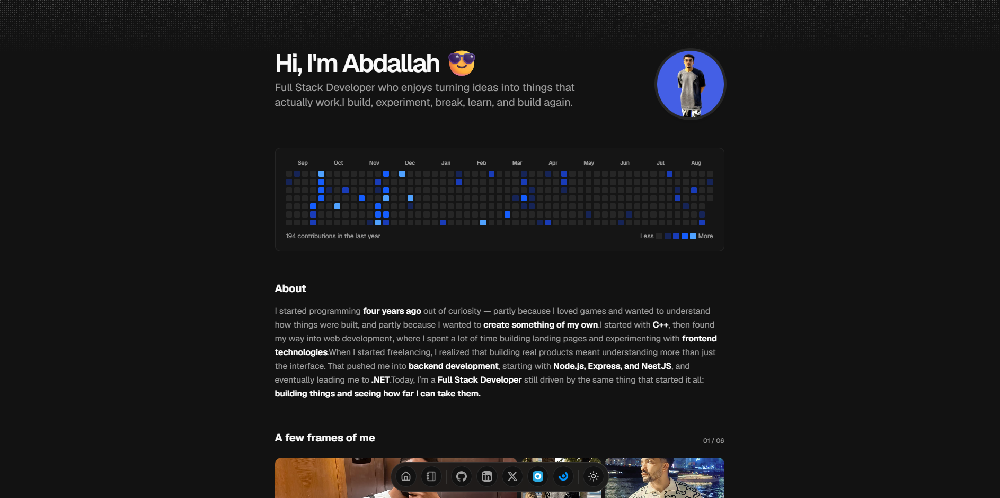

<div align="center">
  
</div>

# Abdallah Atef - Portfolio

Personal portfolio website for **Abdallah Atef**, a Full Stack Developer based in Giza, Egypt. The site presents my background, work experience, education, technical skills, selected projects, and writing in a clean, responsive interface.

## About

I started programming out of curiosity and a desire to understand how the products I use are built. My path began with C++, moved into frontend development and landing pages, and then expanded into backend development with Node.js, Express, NestJS, and .NET.

Today, I enjoy building complete products, learning new technologies, and turning ideas into things that actually work.

## What is Included

- Responsive personal homepage with an introduction and About section
- Work experience and education timeline
- Technology skills section covering React, Next.js, TypeScript, Node.js, Python, C#, .NET, PostgreSQL, Docker, Kubernetes, Java, and C++
- Selected projects with descriptions, technologies, and external links
- MDX-powered blog with individual post pages and pagination
- Light and dark themes
- Open Graph images for the website, blog, and blog posts
- Animated UI details using Motion and Magic UI components

## Built With

- [Next.js 16](https://nextjs.org/) and React 19
- TypeScript
- Tailwind CSS
- [shadcn/ui](https://ui.shadcn.com/)
- [Magic UI](https://magicui.design/)
- Motion
- Content Collections and MDX

## Getting Started

### Prerequisites

- Node.js 18 or newer
- npm or pnpm

### Installation

```bash
git clone https://github.com/abo3tef/portfolio.git
cd portfolio
npm install
npm run dev
```

Open [http://localhost:3000](http://localhost:3000) in your browser.

To update the portfolio content, edit the main configuration object in [`src/data/resume.tsx`](./src/data/resume.tsx).

## Available Scripts

| Command         | Description                  |
| --------------- | ---------------------------- |
| `npm run dev`   | Start the development server |
| `npm run build` | Create a production build    |
| `npm run start` | Start the production server  |
| `npm run lint`  | Run ESLint                   |

## License

This project is licensed under the [MIT License](./LICENSE).
